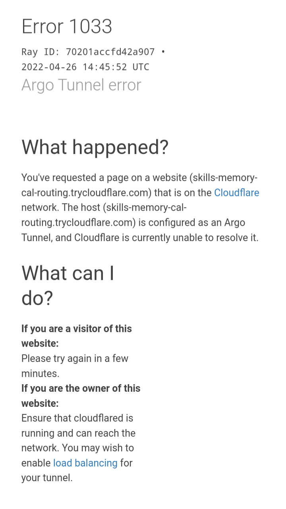
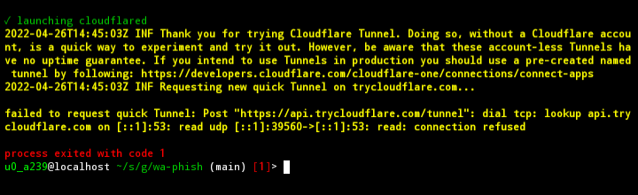

<div align="center">


# Wa-Phish

*whatsapp phishing tool made with nodejs*

**NOTE**

> the victim can re-verify their whatsapp number at anytime 

<br>
<kbd>7 days of hardwork</kbd>
<kbd>1 star ?</kbd>
</div>

# Installation

```bash
cd
pkg install git
pkg install nodejs-lts
git clone https://github.com/im-shamil/wa-phish.git
cd wa-phish
bash install.sh
```

# Usage

> **SORRY IF MY ENGLISH IS BAD**
<br>

**STEPS**


- *download a second whatsapp*

- *turn on hotspot*

- *run the tool*

- *then a yellow coloured message will be displayed in your terminal*

- *wait for a few seconds and you'll see a link there*

- *copy the link and send it to your victim*

- *then return to your terminal*

- *wait for the victim to click the link*

- *when the victim clicks on the link you'll see a message "<kbd>victim connected</kbd>"*

- *then open the second whatsapp and enter your victim's whatsapp number click send otp*

- *return to your terminal*

- *if victim enters the otp and clicks login you'll see a message like (OTP: xxxxxx) you don't need to enter the otp because this tool automatically open whatsapp*

- *if auto open is not working then enter the otp by yourself*


# Errors & solutions

<div align="center">

## ERROR 1



> **SOLUTION**

> __WAIT FOR A FEW MOMENTS AND TRY AGAIN__

<br>

## ERROR 2



> **SOLUTION**

> __TURN ON YOUR MOBILE HOTSPOT AND TRY AGAIN__

</div>

# Suggestion

*you can suggest new features in the [discussion](https://github.com/im-shamil/wa-phish/discussions) page*

# WARNING ⚠️

<kbd>

_this tool was made for educational purpose_

_and im not responsible for any illegal activities done with this tool_

_please use this tool for fair use_

</kbd>
